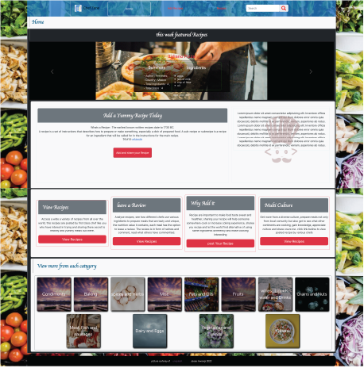

<h2>Recipe Website</h2>

<p>Recipe Website, was develope as part of the school program, the main purpose of this project is to learn coordination of react with inbuild json server, install extension neccessary and ensure that a fully fledged website that can offer information of recipe from diverse community can be stored, accessed and even rated.

### Technologies used

    -   React
    -   CSS
    -   Bootstrap 
    -   HTML

### Database Schems
```json
{
  "recipe": [
    {
      "id": 1,
      "name": "Crock Pot Roast",
      "author": "Jesse Mwangi",
      "ingredients": [
        {
          "ingredientId": "asd123sdf234",
          "quantity": "1",
          "name": " beef roast",
          "type": "MeatFish"
        },
        {
          "ingredientId": "asd123sdf235",
          "quantity": "1 package",
          "name": "brown gravy mix",
          "type": "Baking"
        },
        {
          "ingredientId": "asd123sdf236",
          "quantity": "1 package",
          "name": "dried Italian salad dressing mix",
          "type": "Condiments"
        },
        {
          "ingredientId": "asd123sdf237",
          "quantity": "1 package",
          "name": "dry ranch dressing mix",
          "type": "Condiments"
        },
        {
          "ingredientId": "asd123sdf238",
          "quantity": "1/2 cup",
          "name": "water",
          "type": "Liquids"
        }
      ],
      "steps": [
        {
          "stepid": 1,
          "name": "Place beef roast in crock pot.",
          "timers": 3
        },
        {
          "stepid": 2,
          "name": "Mix the dried mixes together in a bowl and sprinkle over the roast.",
          "timers": 3
        },
        {
          "stepid": 3,
          "name": "Pour the water around the roast.",
          "timers": 5
        }
      ],
      "country": {
        "name": "India",
        "flagUrl": "https://flagcdn.com/in.svg"
      },
      "imageURL": "http://img.sndimg.com/food/image/upload/w_266/v1/img/recipes/27/20/8/picVfzLZo.jpg",
      "alturl": "http://www.food.com/recipe/to-die-for-crock-pot-roast-27208",
      "rating": 4.7,
      "featured": true
    }
    ]
}


```

storage location firebase
### Screen shot



### Disclaimer

<p>Image use and flag are both work of other end point, courtesy of</p> 
    -   images are courtesy of <a href = "https://unsplash.com">Unsplash</a>
    -   Country and flags 

### Intake taken

<p> Used the latest way to create navigation using 'createBrowserRouter'

```Javascript
    createBrowserRouter(createRoutesFromElements(<Route path="/" element={<Name />}>));
```


<p> Organize data into the right structure, the json database had to be in an organized for quick access
and CRUD operation. comments had to be added, receipt needed to be placed in the featured (PUT action), 